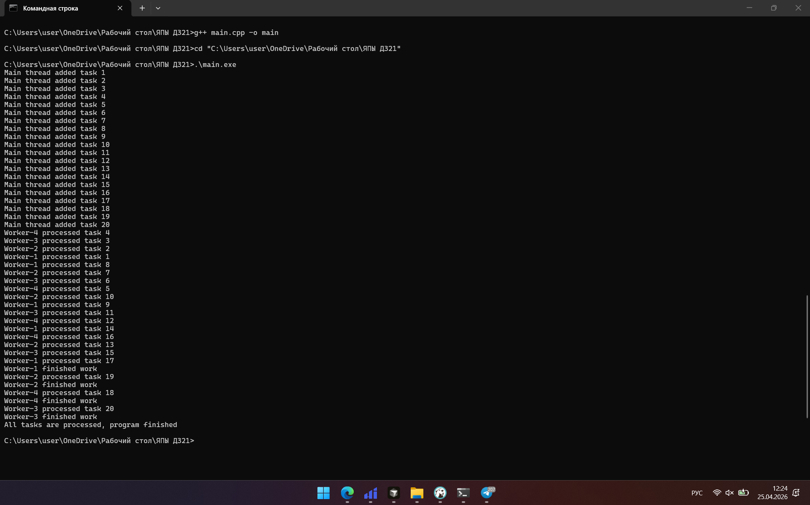

# Отчет по домашней работе

## 1. Титульная часть

ФИО: Голуб Егор Евгеньевич  
Группа: СКБ251  
Дисциплина: Программирование на C++  
Тема: Многопоточность в C++

## 2. Постановка задачи

В этой работе нужно было сделать консольную программу на C++, где несколько потоков обрабатывают задачи из общей очереди.  
Очередь должна быть потокобезопасной, чтобы потоки не мешали друг другу.  
Главный поток добавляет задачи от 1 до 20, а рабочие потоки по очереди их забирают, обрабатывают 1 секунду и выводят сообщение в консоль.

## 3. Описание реализации

Я сделал отдельный класс `TaskQueue`, в котором хранится обычная очередь `std::queue<int>`.  
Но просто очереди тут мало, потому что с ней работают сразу несколько потоков. Поэтому доступ к ней защищен через `std::mutex`.

`mutex` нужен затем, чтобы в один момент времени только один поток менял очередь.  
Если бы его не было, потоки могли бы одновременно взять или добавить задачу, и из-за этого были бы ошибки.

Для ожидания я использовал `std::condition_variable`.  
Это нужно, чтобы поток не крутился постоянно в цикле и не проверял очередь без остановки.  
Если задач нет, поток просто засыпает и ждет сигнал. Когда главная функция добавляет новую задачу, вызывается `notify_one()`, и один из потоков просыпается.

Сначала мне было не совсем понятно, как нормально завершать потоки, чтобы они не висели в ожидании.  
В итоге я сделал флаг `stopped`. Когда главный поток уже добавил все задачи, вызывается метод `stop()`.  
После этого все ожидающие потоки получают сигнал через `notify_all()`.  
Если очередь уже пустая и флаг остановки включен, поток понимает, что новых задач не будет, и завершает работу.

Сами рабочие потоки сделаны через `std::thread`.  
Каждый поток вызывает функцию `worker`, берет задачу из очереди, ждет 1 секунду через `sleep_for`, потом пишет в консоль что-то вроде `Worker-2 processed task 7`.

Я сделал так, потому что это самый понятный вариант без лишних усложнений.  
Тут есть и очередь, и синхронизация, и нормальное завершение потоков, как требовалось в задании.

## 4. Демонстрация

GitHub: https://github.com/Mirox-dev/Multithreading-in-C-

## 5. Вывод

В ходе работы я разобрался, как можно организовать простую многопоточную обработку задач на C++.  
Самое главное здесь было правильно сделать ожидание потоков и их завершение.  
В итоге программа работает корректно: задачи обрабатываются несколькими потоками, гонок на очереди нет, и все потоки нормально завершаются.
